# 🔬 Endoscopic Lesion Localization

<div align="center">

  

<div align="center">
  
</div>

  
  

<br><br>

<table>
  <tr>
    <td align="center"><b>📊 Workflow</b></td>
    <td align="center"><b>💻 Interface</b></td>
    <td align="center"><b>💾 Data Archive</b></td>
  </tr>
  <tr>
    <td align="center"><a href="https://itbworkflow.vercel.app"></a></td>
    <td align="center"><a href="https://abdtb.vercel.app/"></a></td>
    <td align="center"><a href="https://drive.google.com/drive/folders/1XQCivGj5UsD78iUjcUe_vsKN8wfFq5zy?usp=drive_link"></a></td>
  </tr>
</table>

<details>
<summary><b>🌿 Repository Branches</b></summary>

| Branch             | Purpose                                              |
| ------------------ | ---------------------------------------------------- |
| `main`             | Documentation & entry point                          |
| `data-preparation` | Full pipeline (data + models + medsam + evaluation)  |
| `frontend`         | UI & visualization                                   |

</details>

</div>

---

## 👥 Team

| Role    | Name                  |
| ------- | --------------------- |
| Author  | Ishan Jha             |
| Author  | Neil Lohit Bose       |
| Mentor  | Dr. Sujoy K Biswas    |

**Affiliation:** IDEAS — ISI Kolkata

---

## 📋 Overview

This repository contains a **research-oriented pipeline** for lesion detection and segmentation in capsule endoscopy using the Kvasir-Capsule dataset.

The project benchmarks **foundation models (CLIP, BLIP-2, LLaVA, MedSAM)** under zero-shot conditions to evaluate their ability to generalize to a medical imaging domain without any domain-specific training.

---

## 🔬 Problem Statement

Capsule endoscopy generates **thousands of frames per procedure**, making manual inspection both inefficient and error-prone.

This project investigates:

> *Can pretrained foundation models generalize to capsule endoscopy without domain-specific training?*

---

## 🧠 Project Scope

### ✅ Included

- Endoscopic image analysis
- Lesion localization and segmentation
- Zero-shot model evaluation
- Quantitative metrics (IoU, Dice, F1)

### ❌ Excluded

- Clinical diagnosis
- Multimodal medical data
- Automated reporting

---

## 🧭 Methodology

### Stage 1–2: Data Preparation

- Metadata parsing → bounding boxes (4-point → x1, y1, x2, y2)
- OpenCV pipeline for video splitting
- 14 videos → 85 clips
- 1,862 annotated frames

### Stage 3–4: Assembly & Validation

- Clip generation and validation
- Random baseline verification
- Metrics: IoU, Dice, Precision, Recall, F1

### Stage 5–6: Model Evaluation

- CLIP / BLIP-2 / LLaVA evaluated on sampled images
- MedSAM run with ground-truth bounding box prompts
- Segmentation masks generated across the full dataset

---

## 🔄 Pipeline

```
metadata.json → BB extraction → frame extraction → MedSAM → masks → metrics → benchmark comparison
```

---

## 🖼️ Visual Workflow

👉 [https://itbworkflow.vercel.app](https://itbworkflow.vercel.app)

---

## 📊 Dataset Summary

### Overall

| Metric         | Value   |
| -------------- | ------- |
| Total Videos   | 117     |
| Total Frames   | 4.7M+   |
| Classes        | 14      |
| Clips Used     | 85      |
| Frames Used    | 1,862   |

### Class Breakdown (Evaluated Subset)

| Class        | Clips | Frames |
| ------------ | ----- | ------ |
| Ulcer        | 29    | 782    |
| Erosion      | 46    | 397    |
| Blood-fresh  | 9     | 446    |
| Polyp        | 1     | 52     |

---

## 🧪 Models Evaluated

- **CLIP** — Contrastive language-image pretraining (OpenAI)
- **BLIP-2** — Bootstrapped language-image pretraining
- **LLaVA 1.5** — Large language and vision assistant
- **MedSAM** — Segment Anything fine-tuned for medical imaging

---

## 📊 Results

### Vision-Language Models

| Model   | Result                          |
| ------- | ------------------------------- |
| CLIP    | 30% accuracy (majority bias)    |
| BLIP-2  | 0% (hallucinations)             |
| LLaVA   | Partial semantic understanding  |

### MedSAM Segmentation

| Metric          | Value  |
| --------------- | ------ |
| Mean IoU        | 0.5101 |
| Mean Dice       | 0.6152 |
| Micro Precision | 0.8857 |
| Micro Recall    | 0.0998 |
| Micro F1        | 0.1795 |

---

## 📉 Key Findings

- Strong **domain gap** exists in capsule endoscopy for general-purpose foundation models
- MedSAM produces **high-precision masks but very low recall** (~90% of lesions missed)
- **Blood class → 0 detections** across all evaluated models
- **Fine-tuned CNNs significantly outperform** zero-shot foundation models in this domain

---

## 🖼️ Sample Outputs

```
[PLACEHOLDER: ulcer_sample.png]
[PLACEHOLDER: erosion_sample.png]
[PLACEHOLDER: blood_sample.png]
[PLACEHOLDER: polyp_sample.png]
```

---

## 🗂 Repository Structure

### 🔹 `main` Branch

```
endoscopic-lesion-localization/
│
├── README.md
├── dna.svg
│
├── Docs/
│   └── (methodology, presentation, workflow)
│
├── data prep/       ← reference
├── evaluation/      ← reference
├── medsam/          ← reference
└── models/          ← reference
```

### 🌿 `data-preparation` Branch

```
data-preparation/
│
├── data prep/
│   ├── Datasort_script.py
│   ├── build_ground_truth.py
│   └── data_prep.ipynb
│
├── evaluation/
│   ├── Evaluation.ipynb
│   ├── evaluate.py
│   ├── baseline_results.json
│   └── ground_truth.json
│
├── medsam/
│   ├── Medsam_combined.ipynb
│   ├── run_medsam.py
│   ├── evaluate_medsam.py
│   ├── complete_matrics.py
│   └── medsam_complete_metrics.json
│
└── models/
    ├── Testing_of_the_shelf_models.ipynb
    └── test_models.py
```

### 🌿 `frontend` Branch

```
frontend/
│
├── README.md
├── dna.svg
│
├── Docs/
│   └── (shared docs)
│
├── Streamlit/
│   └── app.py
│
└── Frontend-ui/
```

---

## 🚀 Execution

```bash
python build_ground_truth.py
python evaluate.py
python complete_metrics.py
```

---

## 🔮 Future Work

- Fine-tuning MedSAM on Kvasir-Capsule
- Extend evaluation to all 14 lesion classes
- Temporal modeling across video frames
- Full LLaVA evaluation on the complete dataset

---

## 📚 References

- [Kvasir-Capsule Dataset](https://datasets.simula.no/kvasir-capsule/)
- [MedSAM](https://github.com/bowang-lab/MedSAM)
- [CLIP](https://github.com/openai/CLIP) / [BLIP-2](https://github.com/salesforce/LAVIS) / [LLaVA](https://github.com/haotian-liu/LLaVA)

---

## 🙌 Acknowledgement

This research was conducted under the guidance of **Dr. Sujoy K Biswas** at **IDEAS — ISI Kolkata**.
